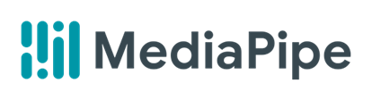

# 중증환자를 위한 스마트 시스템 - 스마트 메이커

본 문서는 2022년도 한성대학교 사물인터넷 캡스톤 디자인에 출제할 프로젝트에 대한 문서입니다.

1장에선 본 프로젝트에 대한 간략한 소개와 정의

2장에선 본 Git 저장소에 대한 사용법 및 소개입니다.


- 아래 본 프로젝트에 참여한 인원과 연락처 입니다.

| 이름         | 학번    | 담당 업무              | 이메일              |
| ------------ | ------- | ---------------------- | ------------------- |
| 박태호(팀장) | 1771363 | 자세/표정모델, 앱 전반 | dkkfkk123@kakao.com |
| 우한솔       | 1771161 | 자세 모델, 앱 담당     | fpdlqm21@naver.com  |
| 김태우       | 1971286 | 표정 모델, 백 엔드     | yun68000@naver.com  |


## 1. 프로젝트 개요

 본 프로젝트는 딥러닝 모델을 통해 환자의 감정과 자세를 분석하여 관련 보호자에게 알림이나 피드백을 주는 앱을 만드는 것이 목표입니다.


순서는 이러합니다.

1. 라즈베리파이로부터 환자의 자세와 얼굴 표정을 인식합니다.
2. 학습된 모델을 통과하여 인식된 이미지를 분석합니다.
3. 분석된 값을 앱을 통해 사용자에게 제공합니다.


## 사용된 툴과 기술 소개

다음은 본 프로젝트를 위해 사용된 기술들에 대한 설명입니다.


### 표정 모델

**Face Detection**

 

- 구글의 미디어 파이프를 이용하여 얼굴을 추출합니다.
- [MediaPipe](https://mediapipe.dev/)


**표정 분류기**

 

- VGGNET 16을 이용하여 학습된 모델을 이용합니다.


**데이터 셋**


- 데이터 세트은 FER 2013을 이용하였습니다.
- 7종으로 분류된 표정 데이터 입니다.
- [Challenges in Representation Learning: Facial Expression Recognition Challenge | Kaggle](https://www.kaggle.com/c/challenges-in-representation-learning-facial-expression-recognition-challenge/data)


### 자세 모델

**Pose Detection**

 

- 텐서플로우의 MoveNet을 이용하였습니다.
- [MoveNet: 매우 빠르고 정확한 포즈 감지 모델.  | TensorFlow Hub](https://www.tensorflow.org/hub/tutorials/movenet)


**자세 분류기**

- MoveNet을 통해 추출한 키포인트를 통해 학습합니다.
- 2장에서 설명합니다.


**데이터 셋**


- AI허브에서 제공하는 데이터 셋을 이용했습니다.
- [AI 허브 (aihub.or.kr)](https://aihub.or.kr/aidata/8014)


### 어플리케이션

- 어플리케이션은 플러터
- 백엔드는 파이어베이스로 제작하였습니다.


## 2. 어플리케이션 실행

**포즈 모델 데모**

```shell
cd pose_model
python camera_memo.py --classifier pose_classifier --label_file pose_labels
```


**표정 모델 데모**

``` shell
cd face_model
python camera.py
```


